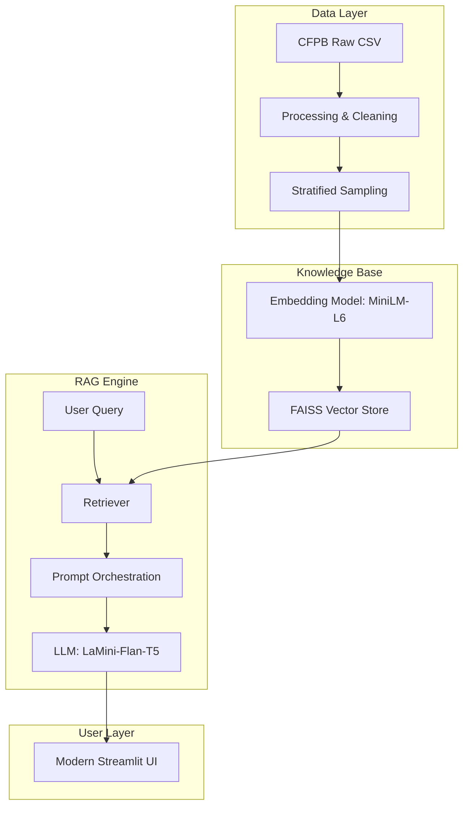

# 🤖 Intelligent Complaint Analysis (RAG Chatbot)

[](https://www.python.org/)
[]()
[]()
[]()

### Transform millions of CFPB complaints into actionable intelligence.

**Intelligent Complaint Analysis** is a powerful Retrieval-Augmented Generation (RAG) system that allows users to interact with the vast **Consumer Financial Protection Bureau (CFPB)** database through a modern, conversational interface. It bridges the gap between raw financial data and human-readable insights.

---

## 🏛️ System Architecture



---

## 📁 Project Structure

```bash
rag-complaint-chatbot/
├── data/                       # Data storage (Raw & Processed)
│   ├── raw/                    # Original CFPB datasets
│   └── processed/              # Cleaned Parquet & sampled data
├── notebooks/                  # Experimental analysis & EDA
├── reports/                    # Task-specific & final documentation
│   ├── figures/                # Visualizations (EDA, UI)
│   ├── task-1.md               # EDA & Preprocessing Report
│   ├── task-2.md               # Vector Store Report
│   ├── task-3.md               # RAG Pipeline Report
│   ├── task-4.md               # UI Development Report
│   └── final-report.md         # Narrative Project Summary
├── src/                        # Core Application Engine
│   ├── app.py                  # Streamlit Web Interface
│   ├── config.py               # Constants & Configurations
│   ├── data_processing.py      # Cleaning & Sampling logic
│   ├── vector_manager.py       # FAISS & Embedding handling
│   ├── retriever.py            # Similarity search logic
│   └── rag_pipeline.py         # LLM & Context Orchestration
├── vector_store/               # Persisted FAISS Index & Metadata
├── requirements.txt            # Project dependencies
└── README.md                   # You are here
```

---

## 🚀 Getting Started (Initialization)

### 1. Prerequisites
- Python 3.8+
- 8GB+ RAM recommended for local model inference.

### 2. Setup
```bash
# Clone the repository
git clone https://github.com/Leul4ever/rag-complaint-chatbot.git
cd rag-complaint-chatbot

# Create virtual environment
python -m venv venv
venv\Scripts\activate  # Windows
# source venv/bin/activate  # Linux/Mac

# Install dependencies
pip install -r requirements.txt
```

### 3. Run the Application
```bash
streamlit run src/app.py
```

---

## �️ Detailed Project Journey

### � Task 1: EDA & Preprocessing
**Objective**: Understand 9.6M complaints and prepare a high-quality subset.
- **Actions**: Filtered for 5 core products (Credit Card, Debt Collection, Loan, Savings, Money Transfers).
- **Outcome**: Implemented a cleaning pipeline (boilerplate removal, whitespace normalization) reducing 6GB raw data to a 97MB optimized Parquet file.

### 🗄️ Task 2: Vector Store Setup
**Objective**: Convert text into searchable mathematical vectors.
- **Actions**: Applied stratified sampling of 15,000 narratives. Used `all-MiniLM-L6-v2` for embeddings.
- **Outcome**: A persisted **FAISS** index containing ~42,000 context chunks with optimal semantic overlap.

### 🧠 Task 3: RAG Core Logic
**Objective**: Build the "brain" of the chatbot.
- **Actions**: Integrated the `LaMini-Flan-T5-248M` model for local CPU inference. Designed a robust "Financial Analyst" prompt.
- **Outcome**: A RAG pipeline that retrieves top-5 relevant chunks and generates grounded, halluncination-free answers.

### 🌐 Task 4: Interactive UI
**Objective**: provide a premium experience for non-technical users.
- **Actions**: Built a **Streamlit** app with custom CSS, chat history, and streaming.
- **Outcome**: An interface where users see token-by-token answers and can expand "Source Documents" to verify every fact.

---

## ✨ Features that WOW
- **🚀 Semantic Search**: Answers questions based on meaning, not just exact keywords.
- **🛡️ Radical Transparency**: Direct citations linked to every AI-generated response.
- **🎨 Modern Dark UI**: Polished design with custom-styled chat bubbles and gradient accents.
- **⚡ Local & Fast**: Optimized for CPU inference using state-of-the-art distilled models.

---

## 🤝 Acknowledgments
- **CFPB** for the comprehensive public database.
- **Hugging Face** & **LangChain** for the open-source building blocks.

---
**Last Updated**: January 3, 2026 ✅
