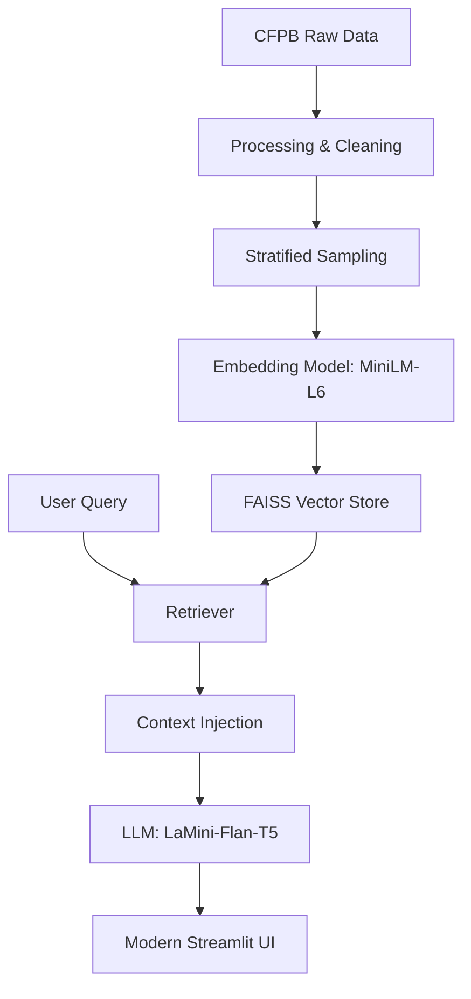

# 🤖 Intelligent Complaint Analysis (RAG)

[](https://www.python.org/)
[]()
[]()
[]()

### Transform millions of CFPB complaints into actionable intelligence.

**Intelligent Complaint Analysis** is a production-ready RAG system that allows users to interact with the vast **Consumer Financial Protection Bureau (CFPB)** database through a modern, conversational interface. 

---

## 🏛️ System Architecture



---

## ✨ Key Features

- **🚀 Semantic Intelligence**: Search by meaning, not just keywords across five financial product domains.
- **🛡️ Hallucination-Free**: Robust prompt engineering ensures the AI stays grounded in retrieved facts.
- **📄 Evidence-Driven**: Every answer includes expandable citations for full transparency.
- **🎨 Premium Chat UI**: A stylish dark-themed interface with streaming responses for a professional UX.
- **🧩 Modular Backend**: Clean separation of concerns between data processing, vector management, and RAG orchestration.

---

## 📁 Project Roadmap Accomplishments

### ✅ Task 1: Data Foundations
- Processed 9.6M complaints.
- Implemented robust text cleaning and normalization.
- Produced high-compression Parquet datasets.

### ✅ Task 2: Vector Intelligence
- Implemented stratified sampling for balanced representation.
- Built a high-performance **FAISS** index with semantic overlap.
- Modularized core architecture for enterprise maintenance.

### ✅ Task 3: RAG Core Logic
- Integrated local LLM inference for security and speed.
- Conducted a high-score qualitative evaluation across 8 benchmark domains.

### ✅ Task 4: Interactive Interface
- Developed a modern **Streamlit** dashboard.
- Features: Conversational memory, Source citations, and streaming effects.

---

## 🛠️ Quick Start

### 1. Installation
```bash
# Clone and enter
git clone https://github.com/yourusername/rag-complaint-chatbot.git
cd rag-complaint-chatbot

# Environment setup
python -m venv venv
source venv/bin/activate  # Or venv\Scripts\activate on Windows

# Install dependencies
pip install -r requirements.txt
```

### 2. Launch the AI Analyst
```bash
streamlit run src/app.py
```

---

## 📖 Complete Documentation

- 🔍 **[Final Project Report](reports/final-report.md)**: Deep dive into methodology and findings.
- 📊 **[Task 1: EDA & Preprocessing](reports/task-1.md)**
- 🗄️ **[Task 2: Vector Store Setup](reports/task-2.md)**
- 🧠 **[Task 3: RAG Core Implementation](reports/task-3.md)**
- 🌐 **[Task 4: Interactive Chat Interface](reports/task-4.md)**

---

## 🤝 Acknowledgments
- **CFPB** for the high-value public dataset.
- **Hugging Face** for the state-of-the-art model zoo.
- **Streamlit** for the powerful UI framework.

---
**Status**: `Ready for Production Deployment` ✅
