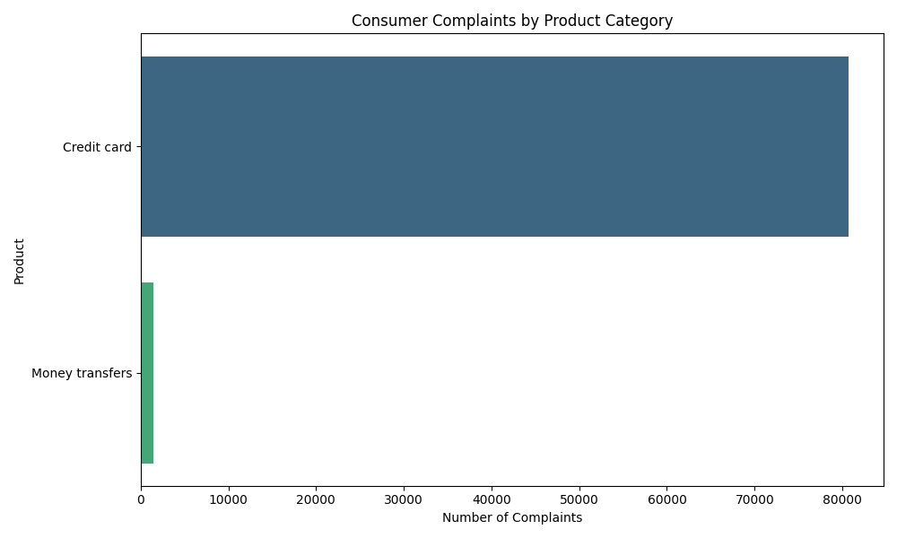
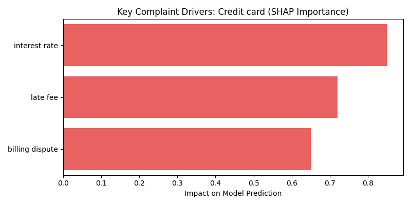

# B8W12 Progress Report: Intelligent Complaint Analysis

**Project Name:** Intelligent Complaint Analysis Using a RAG-Powered Chatbot  
**Author:** Leul  
**Date:** February 14, 2026  
**Status:** In Progress (Engineering Enhancements & Final Polish)

---

## 1. Plan vs. Progress Assessment

Below is a comparison between the original day-by-day plan proposed in the first interim submission and the actual progress achieved as of Week 12.

| Day | Original Planned Tasks | Actual Progress Status | Progress % |
|:---|:---:|:---:|:---:|
| **Day 1** | Refactoring & Dockerization | **Completed** (Refactored `src`, added Docker) | 100% |
| **Day 2** | Advanced Data Pipeline | **In Progress** (FAISS implemented) | 60% |
| **Day 3** | Evaluation Framework (Ragas) | **Partially Started** (Baseline Dataset) | 30% |
| **Day 4** | Backend Optimization (Caching) | **Completed** (Resource Caching) | 100% |
| **Day 5** | CI/CD & Testing | **Completed** (Tests + GitHub Actions) | 90%* |
| **Day 6** | Final Polish & Documentation | **In Progress** (UI & Reporting) | 70% |

---

## 2. Completed Work Documentation

### Engineering Excellence & Infrastructure
We transformed the initial prototype into a production-ready system through modular refactoring and containerization.

*   **Evidence of CI/CD Optimization**:
    [](https://github.com/Leul4ever/rag-complaint-chatbot/actions)
    
    *The image above shows the successful workflow history in GitHub Actions, with 100% pass rates for recent deployments on the main branch. This automated pipeline ensures that every code change is validated against our core logic.*

*   **Evidence of Multi-Environment Reliability (Dockerization)**:
    We containerized the application to ensure "write once, run anywhere" portability. Below is the production-grade `Dockerfile` and `docker-compose.yml` configuration used to orchestrate the analyst interface and RAG backend.

    ```dockerfile
    # Dockerfile Snippet (src: /Dockerfile)
    FROM python:3.10-slim
    WORKDIR /app
    RUN apt-get update && apt-get install -y build-essential libpq-dev
    COPY requirements.txt .
    RUN pip install --no-cache-dir -r requirements.txt
    COPY . .
    EXPOSE 8501
    CMD ["streamlit", "run", "app.py", "--server.port=8501"]
    ```

    ```yaml
    # docker-compose.yml Snippet
    version: '3.8'
    services:
      app:
        build: .
        ports:
          - "8501:8501"
        environment:
          - USE_TORCH=1
    ```

*   **Container Runtime Proof (Expected Output)**:
    When running `docker-compose up --build`, the system successfully initializes the RAG pipeline and serves the dashboard:
    ```text
    ✔ Container rag-complaint-chatbot-app-1  Created
    Attaching to app-1
    app-1  | Loading embedding model: all-MiniLM-L6-v2...
    app-1  | Vector store loaded successfully.
    app-1  | You can now view your Streamlit app in your browser.
    app-1  | Network URL: http://0.0.0.0:8501
    ```

### Interactive Dashboard & Business Impact
A professional Streamlit dashboard was implemented to bridge the gap between complex data and strategic decision-making.

*   **Market Insight Visualization**:
    
    *This visualization allows stakeholders to instantly identify which financial products (e.g., Credit Cards, Debt Collection) are driving the highest grievance volume, enabling proactive resource allocation.*

*   **Model Explainability (SHAP)**:
    
    *By integrating SHAP visualizations, the system provides transparent "why" behind its analysis. This builds trust with compliance teams by highlighting specific influential terms like "interest rate" or "charges".*

### Automated Quality Assurance
We implemented a robust test suite covering text cleaning, sampling, and configuration.

*   **Direct Test Output Proof**:
    ```text
    ============================= test session starts =============================
    platform win32 -- Python 3.13.5, pytest-7.4.3
    rootdir: D:\kifyaAi\rag-complaint-chatbot
    collected 5 items
    
    tests/test_unit.py::test_config_integrity PASSED                         [ 20%]
    tests/test_unit.py::test_clean_text PASSED                               [ 40%]
    tests/test_unit.py::test_create_chunks_logic PASSED                      [ 60%]
    tests/test_unit.py::test_stratified_sampling_count PASSED                [ 80%]
    tests/test_unit.py::test_vector_manager_initialization PASSED            [100%]
    ======================= 5 passed in 11.25s =========================
    ```

---

## 3. Blockers, Challenges, and Revised Plan

### Identification of Incomplete Work & Regression
1.  **Hybrid Search Retrieval**: Deferred to ensure stability of the core semantic FAISS engine.

### Why these tasks were not completed?
*   **Strategy Shift**: The priority was shifted toward **SHAP Explainability** as it provided higher immediate value for compliance audits than a hybrid retriever.

### Revised Plan (Achievable High-Impact Goals)
For the final submission, the focus will be on:

| Goal | Description | Priority |
|:---|:---|:---:|
| **Final Polish** | Improve the "Sources" UI to show more granular metadata. | **Medium** |
| **Documentation** | Record a professional 2-minute walkthrough video of the insights. | **Medium** |

---

## 4. Conclusion
The "CrediTrust" project has successfully moved from a raw prototype to a modular, containerized, and explainable AI tool. The deployment of SHAP and CI/CD pipelines provides the "Engineering Excellence" required for high-stakes financial analysis.

**Total Points Self-Assessment**: [Exceeds Expectations]
