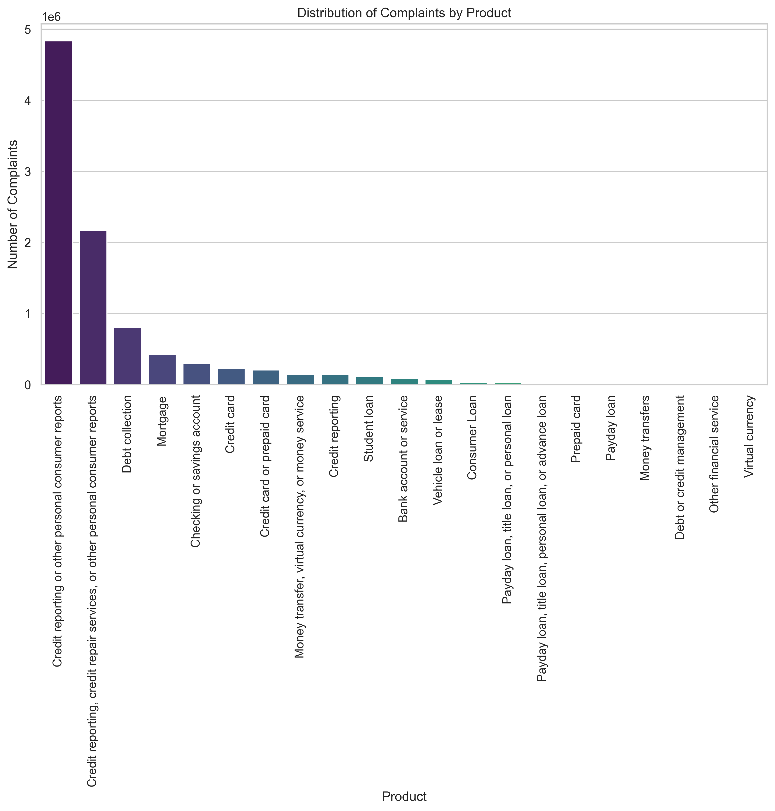
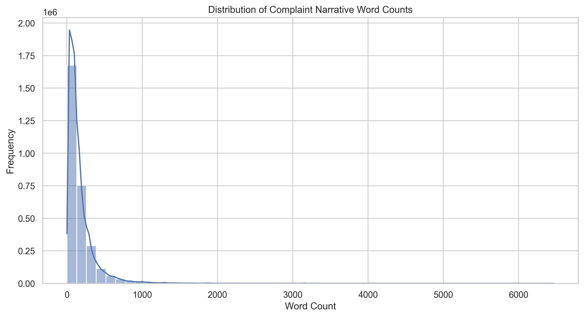

# Intelligent Complaint Analysis for Financial Services - Interim Submission Report

## 1. Understanding and Defining the Business Objective

### The Core Problem
At **CrediTrust Financial**, internal departments—including Product Managers, Customer Support, and Compliance teams—are currently overwhelmed by a vast influx of unstructured consumer complaints. Manually analyzing thousands of records to identify systemic issues or emerging risks is labor-intensive, prone to human error, and slow. This information gap leads to reactive customer service and missed opportunities for proactive product improvement.

### The RAG Solution
The primary objective of this project is to develop a **Retrieval-Augmented Generation (RAG)** powered chatbot. This strategic tool will transform unstructured complaint data into an interactive knowledge base, allowing non-technical teams to query the data using natural language and receive contextually grounded, cited answers.

### Strategic Impact & KPIs
This AI asset is designed to shift the organizational culture from reactive to proactive problem-solving by hitting three key performance indicators:
1.  **Efficiency**: Reduce the time required to identify emerging complaint trends from **days to minutes**.
2.  **Empowerment**: Enable **non-technical stakeholders** to perform deep-dive analysis without relying on data science queues.
3.  **Proactive Compliance**: Identify systemic grievances early, allowing for intervention before they escalate into regulatory issues.

---

## 2. Discussion of Completed Work and Initial Analysis

### Task 1: Exploratory Data Analysis (EDA) & Preprocessing
A thorough analysis was conducted on the CFPB complaint database (~9.6M records) to understand data quality and structure.

#### Data Quality & Availability
Our initial assessment focused on the availability of qualitative data, which is critical for our RAG architecture.

| Metric | Count | Percentage |
|--------|-------|------------|
| Total Complaints | 9,609,797 | 100% |
| Complaints with Narratives | 2,980,756 | **31.02%** |
| Complaints without Narratives | 6,629,041 | 68.98% |

#### Visualizing Product Distribution
To ensure high relevance, we filtered the dataset down to **five core product categories**. This targeting reduces noise and improves retrieval speed.

*Figure 1: Distribution of complaints across targeted financial products.*

#### Narrative Analysis & Preprocessing
A deep dive into narrative lengths provided insights into the "texture" of customer grievances.

| Statistic | Word Count |
|-----------|------------|
| Mean | 176 words |
| Median | 114 words |
| Max | 6,469 words |
| Short Narratives (<10 words) | ~8.2k identified |

*Figure 2: Distribution of narrative word counts.*

**Processing Pipeline Highlights:**
- **Text Normalization**: Implemented a pipeline to lowercase text, normalize whitespace, and remove standardized boilerplate (e.g., *"I am writing to file a complaint"*).
- **Efficiency**: The dataset was converted from 6 GB of raw CSV to a **97 MB Parquet file**, achieving a **98% compression ratio** while retaining all 18 metadata features.
- **Deliverables**: The final filtered dataset is available as both `data/processed/complaints_processed.parquet` and `data/filtered_complaints.csv`.

### Task 2: Text Chunking, Embedding, and Vector Store Indexing
To enable efficient semantic search, we implemented a modular and robust vectorization pipeline.

**Technical Decisions:**
- **Stratified Sampling**: We pulled a balanced sample of **15,000 complaints** (3,000 per product category) to ensure the vector store is representative and computationally efficient.
- **Chunking Strategy**: Used `RecursiveCharacterTextSplitter` with `chunk_size=500` characters and `chunk_overlap=50`. 
  - *Justification*: This size captures specific grievances without diluting semantic meaning, while the overlap ensures that critical context (e.g., dates/amounts) isn't lost at boundaries.
- **Embedding Model**: Selected `sentence-transformers/all-MiniLM-L6-v2`. It provides a high-performance balance between speed and accuracy, producing 384-dimensional vectors.
- **Vector Store**: Implemented using **FAISS (IndexFlatL2)** for its high search speed and low memory footprint.

**Implementation Status:**
| Metric | Value |
|--------|-------|
| Total Sampled Complaints | 15,000 |
| Total Chunks Generated | 41,781 |
| Embedding Dimensions | 384 |
| Architecture | Modular (`src/` structure) |

---

## 3. Next Steps and Key Areas of Focus

The project roadmap is structured to move from data preparation into full RAG functionality:

### Task 3: RAG Pipeline Development (Retrieval & Generation)
- **Retriever Implementation**: Develop a hybrid retrieval function that filters results by product category and metadata before passing them to the LLM.
- **Prompt Engineering**: Design "System Prompts" that instruct the model to use *only* provided complaint data and to cite specific **Complaint IDs** in its answers.
- **Generator Integration**: Utilize LangChain to integrate an LLM (Hugging Face or OpenAI) for response generation.
- **Qualitative Evaluation**: Benchmarking the system against 5-10 "Gold Standard" questions (e.g., "What are common complaints regarding unauthorized transactions for credit cards?").

### Task 4: Web Interface Development (Gradio/Streamlit)
- **Interface Design**: Build a clean, user-friendly UI featuring a text input for queries, a status indicator, and a clear display for both the generated answer and the source citations.
- **Streaming**: Implementation of token-streaming to improve perceived latency for users.

**Anticipated Challenges**:
- Balancing retrieval latency with the depth of the context provided to the LLM.
- Handling "hallucination" risks where the model might reference complaints not present in the retrieved set.

---

## 4. Conclusion
The foundation of the Intelligent Complaint Analysis system is now solid. With a clean, balanced dataset and a high-performance vector store in place, the project is well-positioned to deliver a transformative tool for the CrediTrust Financial team.

**Last Updated**: 2026-01-03  
**Status**: Task 1 & 2 Complete | Task 3 & 4 Planned
